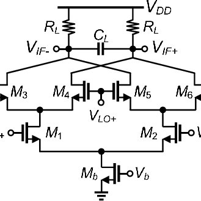
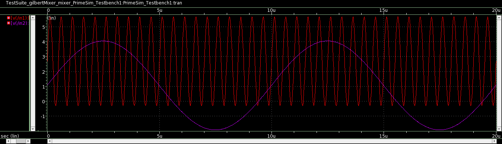
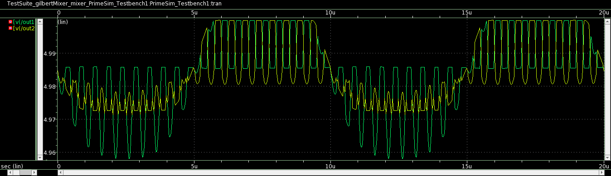
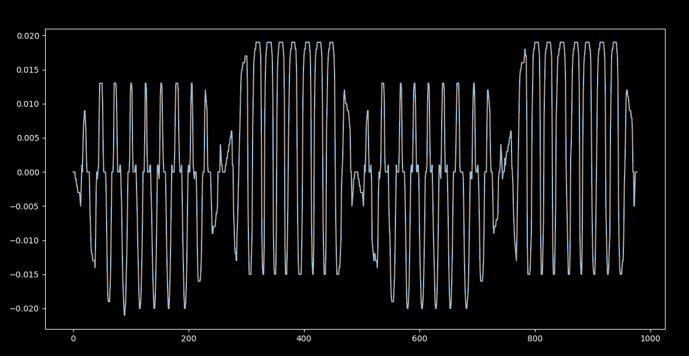

# Design of a Gilbert Cell Multiplier
This repository features the implementation of a Gilbert Cell Multiplier using Synopsys iPDK and Synopsys Custom Design Compiler. The circuit is designed uses 28nm CMOS Technology.

 # Table of Content
* [Abstract](#abstract)
* [Design Details](#design_details)
* [Tools Used](#tools_used)
* [Reference Circuit](#reference_circuit)
* [Designed Circuit](#designed_circuit)
* [Netlist](#netlist)
* [Acknowledgements](#acknowledgements)
* [References](#references)

# Abstract
A Gilbert Cell is designed and implemented using CMOS logic with the help of Synopsys iPDK and Synopsys Custom design Platform. The Gilbert cell is a cross-coupled differential amplifier. It is a type of RF mixer circuit which is widely used in a range of applications. It is a double balanced mixer in which the symmetrical topology is used to remove the unwanted RF(Radio frequency) and LO(local Oscillator) output signals from the IF(Intermediate frequency) signal by cancellation for required applications. Though it requires a higher number of components, Gilbert cell is widely used due to its performance benefits.

# Design Details
Gilbert Cell is an analog multiplier or mixer circuit that takes in two signals as input and produces their analog product as output. It can be viewed as a circuit whose gain can be electrically controlled. It is a popular choice for IC design since it can be built only using transistors without a need for components like inductors which are harder to fabricate. The popular applications of Gilbert cell include Variable gain amplifier, Four quadrant analog multiplier, Automatic gain control circuits, phase detector and frequency mixer. It can be used in modulation processes like AM, SSB and DSB.

The main component of a Gilbert cell is a differential amplifier pair which is built using four transistors. The first input signal of the mixer is provided to this circuit. The differential pair needs to be supplied with two dependent current sources. The gain of the differential pair depends on these tail current values. A Third differential amplifier circuit is used to act as the current source for the differential pair. The operation of the third diff-amplifier depends on the input voltage level provided by the second input signal of the mixer. This entire setup is referred to as the Gilbert Cell or Gilbert mixer circuit. The output of the system is the analog product of two input signals scaled by a constant factor.
 

# Initial Report
The Initial Report for the design can be found [here](CircuitReport.pdf)
 

# Tools Used

* [**Synopsys Custom Design Suite**](https://www.synopsys.com/implementation-and-signoff/custom-design-platform.html) : The Synopsys Custom Design Platform is a unified suite of design and verification tools that accelerates the development of robust analog and mixed-signal designs. The platform features Custom Compiler™, a fast, easy-to-use design, and layout solution, PrimeSim™ Continuum, which delivers industry-leading circuit simulation performance, and best-in-class technologies for parasitic extraction, reliability analysis, and physical verification.

* **Synopsys 28nm PDK** The Synopsys 28nm Process Design Kit (PDK) was used in design and simulation of the circuit. 
 

# Reference Circuit

# Implemented Design

## Circuit
The following is the circuit designed and simulated in Synopsys Design tool.

  
The design can be simulated and output can be verified using [falsted.com](https://www.falstad.com/circuit/circuitjs.html) as well, by opening this design file - [mixer3.circuitjs.txt](./mixer3.circuitjs.txt) in the platform.
  

## Test Bench

 

# Netlist
The netlist obtained from the simulation can be found [here](gilbertMixer_mixer.sp)

 

# Simulation Output
* ### Input Signals
The Circuit was excited using two sine waves with frequencies 2000 kHz and 10 KHz. The signals are as shown
  

  
* ### Output Signals
The designed Circuit produces the analog product of the two input signals in the form of two difference signals (out1 and out2). The actual analog product is given by the absolute difference of these two signals.
 

  
* The actual output ie, the analog product of the two input signals is given by the difference of the two output signals (out1 and out2). It is as shown.

 

# Author
G. Victor Swaroop - [@gvictorsd](https://github.com/GVictorsd)
 BTech in Electronics and Communication Engineering, 
 VNR Vignana Jyothi Institute of Engineering and Technology, Hyderabad.
  

# Acknowledgements
* [Cloud based Analog IC Design Hackathon, IIT Hyderabad](https://hackathoniith.in/)
* [VSD Corp. Pvt Ltd](https://www.vlsisystemdesign.com/)
* [Synopsys India](https://www.synopsys.com/)

 

# References
[1] Pouya Solati, Mohammad Yavari, A wideband high linearity low noise CMOS active mixer, Springer Science media.
